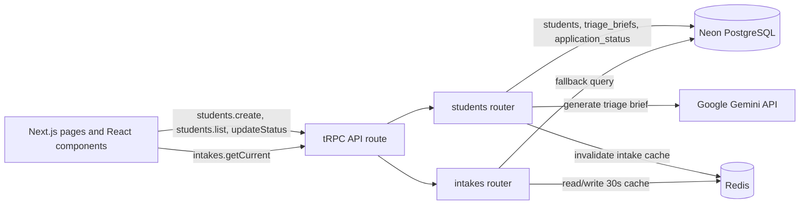

# CounselConnect

LINK:https://counsel-connect-six.vercel.app/

CounselConnect is a student-intake and counsellor operations tool for
admissions teams. A student submits an academic and study-preference profile, the
server generates an optional Gemini triage brief, and a counsellor reviews and
progresses the submission from an internal dashboard.

This repository is a focused end-to-end vertical slice rather than a complete
admissions platform. It demonstrates the intake-to-review workflow with persistent
PostgreSQL data, typed tRPC procedures, AI-assisted triage, and a cached intake
capacity counter.

## Features

### Student intake

The home page (`/`) contains a validated intake form for:

- Full name and email (required)
- Phone number
- CGPA, from 0 to 10
- Years of work experience
- Budget in INR
- Course interest
- Preferred country
- Intake period, such as `May 2027`

Client-side and server-side validation share the Zod schema in
`src/lib/validation/student.ts`. After a successful submission, the student sees a
confirmation message and can submit another response.

### AI triage

`students.create` sends the academic and preference fields to Google Gemini and asks
for a structured JSON brief containing:

```json
{
  "summary": "Short counsellor-facing assessment",
  "suggested_countries": ["Country 1", "Country 2"],
  "flags": ["Anything requiring attention"]
}
```

The response is parsed defensively before it is stored. A missing API key, API error,
empty response, or malformed JSON does not prevent the student record from being
saved; the dashboard displays `Triage unavailable` instead.

### Counsellor dashboard

The dashboard (`/dashboard`) provides:

- A current-intake seat counter and percentage bar
- A newest-first table of student submissions
- Contact details, AI triage summary, and suggested countries
- Per-student status updates: `new`, `reviewed`, `contacted`, or `converted`
- Empty, loading, and error states for the dashboard queries

Status changes are persisted in PostgreSQL and are reflected after the list query is
invalidated.

## Architecture



### Application layers

- **Frontend:** Next.js 14 App Router, React 18, TypeScript, and Tailwind CSS.
- **API:** tRPC procedures are mounted at `app/api/trpc/[trpc]/route.ts` and share
  types between the client and server.
- **Persistence:** Drizzle ORM uses Neon serverless PostgreSQL. The schema source of
  truth is `src/server/db/schema.ts`.
- **AI:** `src/server/ai/triage.ts` builds the prompt, calls Gemini server-side, and
  validates the response shape.
- **Caching:** Redis caches `intakes.getCurrent` for 30 seconds. Student creation
  invalidates the `intake:current` key after incrementing the seat count. Redis
  failures are logged and the intake query falls back to PostgreSQL.
- **Production container:** Next.js is built with standalone output and served by the
  Node runtime in the Docker image.

### Database tables

- `students` stores the submitted profile and creation time.
- `intakes` stores the current period, seat cap, and filled-seat count.
- `triage_briefs` stores the generated summary, suggested countries, flags, and
  generation time.
- `application_status` stores the current status and last update time for each
  student.

### tRPC procedures

- `students.create(input)` inserts a student, increments the current intake count,
  generates a triage brief, and returns the new student.
- `students.list()` returns students newest first with their triage brief and status.
- `students.updateStatus({ studentId, status })` creates or updates a student's
  application status.
- `intakes.getCurrent()` returns the current intake or `null`.

## Prerequisites

- Node.js 20 or newer
- npm
- A Neon PostgreSQL database and connection string
- Redis 7 or another Redis-compatible server
- A Google AI Studio API key for live triage generation

Gemini is optional for basic intake persistence: without `GEMINI_API_KEY`, the
submission is saved and its triage brief is unavailable. `DATABASE_URL` and
`REDIS_URL` are required because the server initializes both clients at startup.

## Local setup

1. Install dependencies:

   ```bash
   npm install
   ```

2. Create an environment file:

   ```bash
   cp .env.example .env
   ```

   On Windows PowerShell, use `Copy-Item .env.example .env` instead.

3. Set the values in `.env`:

   ```dotenv
   DATABASE_URL=postgresql://<user>:<password>@<host>/<database>?sslmode=require
   GEMINI_API_KEY=<google-ai-studio-key>
   REDIS_URL=redis://localhost:6379
   ```

4. Apply the Drizzle schema and create the initial 60-seat intake:

   ```bash
   npm run db:push
   npm run db:seed
   ```

5. Start the development server:

   ```bash
   npm run dev
   ```

   Open [http://localhost:3000](http://localhost:3000) for the intake form and
   [http://localhost:3000/dashboard](http://localhost:3000/dashboard) for the
   counsellor dashboard.

## Docker setup

Docker Compose starts the Next.js container and a Redis 7 container. PostgreSQL is
still hosted by Neon, so `DATABASE_URL` must point to a reachable Neon database.

For the app container, Redis is addressed by the Compose service name rather than
`localhost`:

```dotenv
DATABASE_URL=postgresql://<user>:<password>@<host>/<database>?sslmode=require
GEMINI_API_KEY=<google-ai-studio-key>
REDIS_URL=redis://redis:6379
```

Then build and start the stack:

```bash
docker compose up --build
```

The app is available at [http://localhost:3000](http://localhost:3000). Run database
migrations and seeding from a Node environment with the same `DATABASE_URL` before
using the dashboard, for example with `npm run db:push` and `npm run db:seed` on the
host.

## Useful commands

```bash
npm run dev        # Start the Next.js development server
npm run build      # Create a production build
npm run start      # Serve the production build
npm run typecheck  # Run TypeScript without emitting files
npm run lint       # Run Next.js linting
npm run db:push    # Apply the Drizzle schema to PostgreSQL
npm run db:seed    # Insert a May 2027 intake with a 60-seat cap
npm run verify     # Exercise the tRPC procedures end to end
```

`npm run verify` creates a timestamped test student, checks the list procedure,
updates that student's status to `reviewed`, and confirms that the seat count
increases by one. It writes data to the configured database.

## Project structure

```text
app/
  page.tsx                         Student intake route
  dashboard/page.tsx               Counsellor dashboard route
  api/trpc/[trpc]/route.ts          tRPC HTTP adapter
src/
  components/intake-form/           Intake form UI
  components/dashboard/             Seat counter and students table
  lib/validation/                   Shared Zod validation
  server/routers/                   tRPC procedures
  server/ai/                        Gemini prompt and response parsing
  server/db/                        Drizzle client, schema, and seed script
  server/redis/                     Redis client
```

## Scope and limitations

The current build does not include:

- Authentication or role-based authorization; the dashboard is public when deployed.
- Email, notification, deadline, or capacity-alert automation.
- A full country/university recommendation catalogue or admissions rules engine.
- A background job for AI generation; the create mutation currently waits for the
  Gemini call before returning.
- Automated browser tests or a full unit-test suite.

The seat increment and status upsert are implemented as sequential database
operations. High-concurrency seat guarantees and transactional workflows would need
additional database and deployment work before production use.
